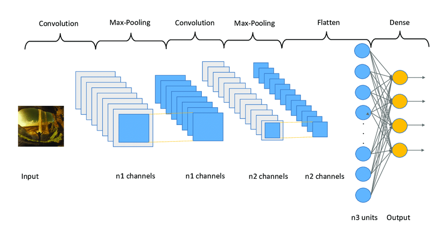

# Deep Learning Assignment - Sequence Processing with ConvNets (Chollet DL Book - Chapter 6)

## Overview

This assignment is part of my Deep Learning module at NED University, as part of my Post Graduate Diploma (PGD) in Data Science. The task involves implementing sequence processing models using Convolutional Neural Networks (ConvNets) from Chapter 6 of François Chollet’s *Deep Learning with Python* (First Edition). In this assignment, I experimented with two datasets: Netflix data and the Jena Climate data (2009-2016) for different sequence processing tasks.

I followed the structure of the original notebook (available [here](https://github.com/fchollet/deep-learning-with-python-notebooks/blob/master/first_edition/6.4-sequence-processing-with-convnets.ipynb)) and modified the architecture and parameters to better suit the datasets and improve model performance.

# CNN Architecture

This is the Convolutional Neural Network architecture used in the project.

## Dataset and Approach

1. **Netflix Dataset**: For Conv1D sequence processing, I replaced the original IMDB dataset used in the notebook with Netflix data. The task was to classify sequences into 3 categories instead of binary classification. To achieve this, I made the following changes:
   - Performed data cleaning and preprocessing.
   - Changed the output layer from `sigmoid` to `softmax` to handle 3 output classes.
   - Adjusted other parameters to accommodate the change in dataset and the number of classes.
   - Updated the input layers as per the new dataset format and ensured the model works effectively.

2. **Jena Climate Dataset (2009-2016)**: For the sequence processing task with 2D ConvNets, I worked with the Jena Climate dataset. The original model from the notebook produced extremely high loss values (such as 5894851452145212), which indicated poor model performance. To address this:
   - I modified the architecture by adding more layers and adjusting the hyperparameters.
   - I also used a GRU-based model instead of the original Conv1D, as the sequence data required more sophisticated processing.
   - By making these changes, the model showed better results, and the loss values became more reasonable and manageable.

## Key Modifications

- **Input Layers**: I modified the input layers for both Netflix and Jena Climate datasets to match the shape and format of the data being used.
  
- **Output Layer**: 
   - For the Netflix dataset (3 classes), I changed the activation function from `sigmoid` to `softmax`.
  
- **Parameters**: 
   - I updated the parameters where necessary, as some older versions were deprecated. For example, I replaced the `fit_generator()` method with `fit()` to align with the updated Keras API.
  
- **Model Architecture**: 
   - For the Jena Climate dataset, I updated the model architecture by incorporating more complex layers like GRU, which led to more effective results compared to the original architecture.
  
- **Loss Calculation**: 
   - The original loss values in the Jena Climate dataset were extremely high, indicating that the model wasn't well-suited to the dataset. After modifications, the loss values became more stable, and the model performed better.

## Notebook and Original Code

The original notebook from *Deep Learning with Python* by François Chollet can be found [here](https://github.com/fchollet/deep-learning-with-python-notebooks/blob/master/first_edition/6.4-sequence-processing-with-convnets.ipynb).

### Original Approach:
- The notebook utilizes a simple Conv1D-based architecture for sequence processing tasks.
- It demonstrates sequence classification with IMDB movie reviews dataset, where the goal is binary classification using Conv1D layers.

### My Approach:
- I experimented with the sequence processing techniques on different datasets, modifying both the model architecture and parameters to achieve better performance.
- I also shifted from binary to multi-class classification for Netflix data, which required adjusting the activation function and output layer.

## Future Directions

- **Experimenting with Other Datasets**: The techniques used in this assignment can be extended to other datasets requiring sequence classification, such as weather forecasting, stock price prediction, or speech recognition.
  
- **Tuning Hyperparameters**: Further optimization of the model’s hyperparameters could potentially improve the performance even more.

## Conclusion

This assignment helped me gain hands-on experience in sequence processing with ConvNets and highlighted the importance of tuning model architectures and parameters based on the data at hand. Through this process, I gained deeper insights into how to effectively apply deep learning techniques for time-series and sequential data problems.

---

Feel free to explore the code in the notebook and modify it for your own experiments!

---

## License

This project is licensed under the MIT License - see the [LICENSE](LICENSE) file for details.
